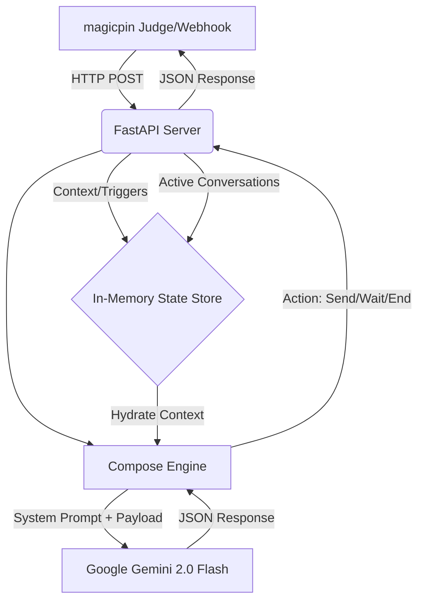

# Vera AI Assistant

A high-performance, stateless conversational agent built for the magicpin merchant network. Vera automates merchant communications, manages WhatsApp interactions, and drives merchant growth through context-aware recommendations.

## Architecture

Vera is built as a single-binary FastAPI service exposing a stateful, robust HTTP contract.




The core conversational engine (`compose()`) utilizes a deterministic multi-context pipeline. It ingests four layers of context (category, merchant, trigger, customer) and synthesizes localized, highly personalized responses using Google's Gemini LLM. The engine is tuned via a strict rubric-derived system prompt ensuring:
- **High Specificity:** Anchoring on concrete metrics and active merchant catalogs.
- **Brand Consistency:** Maintaining category-specific tone while respecting strict negative vocabularies.
- **Engagement Optimization:** Utilizing behavioral levers like social proof and open-ended curiosity hooks.

### Core Features

- **Asynchronous Composition Pipeline:** LLM synthesis is managed via a ThreadPoolExecutor with strict timeout enforcement to guarantee SLA compliance (<30s).
- **Idempotent Context Synchronization:** The `/v1/context` ingestion endpoint ensures distributed consistency with conflict resolution (HTTP 409) for stale updates.
- **Multi-turn State Management:** The `/v1/reply` endpoint manages conversational state, featuring zero-shot intent routing and native handling for hostile/off-topic detours.
- **Auto-reply Detection:** Heuristic identification of merchant/customer auto-responders prevents bot-to-bot infinite loops.
- **WhatsApp Template Compliance:** Differentiates between initial session-opening templated dispatches and subsequent free-form replies (24h rule).

## Team Information
- **Team Name:** Kavin
- **Team Members:** Kavin Mathur
- **Contact Email:** kavin.mathur.ug23@nsut.ac.in

## Production Deployment

The service is currently deployed as a containerized workload using Docker.

- **Base URL:** `https://vera-ai-bot-obtb.onrender.com`
- **LLM Provider:** Google Gemini (`gemini-2.0-flash`)
- **Runtime:** Docker / Python 3.11

### Core Endpoints

| Endpoint | Method | Description |
|---|---|---|
| `/v1/healthz` | `GET` | Service liveness and telemetry probe. |
| `/v1/metadata` | `GET` | System configuration and versioning data. |
| `/v1/context` | `POST` | Ingests and versions knowledge artifacts. |
| `/v1/tick` | `POST` | Processes scheduled triggers and initiates outbound conversations. |
| `/v1/reply` | `POST` | Handles inbound webhooks for active multi-turn sessions. |

## Local Development

### Prerequisites
- Python 3.11+
- Docker (optional, for containerized deployment)
- Google Gemini API Key (get one free at [Google AI Studio](https://aistudio.google.com/apikey))

### Setup
The service is designed to be provider-agnostic. All secrets and provider configurations are injected via the environment.

1. Configure `.env` with valid LLM credentials (see `.env.example` if applicable).
2. Install dependencies:
   ```bash
   pip install -r requirements.txt
   ```
3. Initialize the server:
   ```bash
   uvicorn bot:app --host 0.0.0.0 --port 8080
   ```

### Local Testing (Simulator)
To test the bot locally using the challenge's provided `judge_simulator.py`:

1. Ensure the FastAPI server is running in one terminal window.
2. In a second terminal window, navigate to the challenge root directory.
3. Export the target URL and run the simulator:
   ```bash
   export BOT_URL=http://localhost:8080
   python judge_simulator.py
   ```

